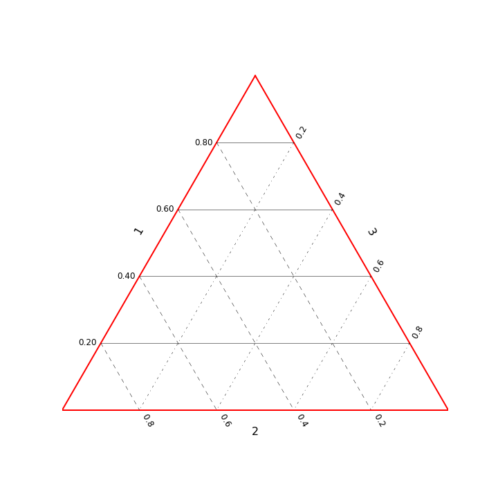

# ternarpy
Functions to help create ternary plots in matplotlib.

Based on this stackoverflow answer: http://stackoverflow.com/questions/701429/library-tool-for-drawing-ternary-triangle-plots/6076050#6076050

####Functions

#####make_basis()  
Make the basis vectors for transforming 3D data to 2D.

#####transform(data,basis)  
Transform 3D ratio data into a 2D ternary format.  
The rows of the data must some all be positive real numbers and sum to 1.

#####setup_plot(ax, ax, side_labels=None, grid_values=None, **kwargs  
Setup the plot by making the outer border, making grid lines, and labeling the sides.
	
ax: A matplotlib axes handle for where the plotting will take place  
side_labels: A list of strings for labeling the sides. The order of the labels must be the same order	as the data.  
grid_values: A list or numpy array of values between 0 and 1 to put grid lines at, for all sides.  
	
The kwargs can be:  

label_offset: A factor for offsetting the side labels (default: 0.2)  
tick_offset: A factor for offsetting the tick labels (default: 0.2)  
label_args: a dictionary of formatting arguments passed to ax.text() for the side labels  
tick_args: a dictionary of formatting arguments passed to ax.text() for the tick labels  
edge_args: a dictionary of formatting arguments passed to pylab.plot() for the triangle edge lines.  
grid_args: a dictionary of formatting arguments passed to the grid line plotting  

####Simplest Example
```python
from matplotlib import pylab
from ternarpy import *

fig, ax = pylab.subplots(figsize=(10,10))
setup_plot(ax)
```



####Protein Bar Example
The data are from: http://www.reddit.com/r/Fitness/comments/36bj9n/spreadsheet_of_protein_bar_statistics/

```python
from matplotlib import pylab
from ternarpy import *
import pandas as pd

df = pd.read_table("Example/bars.txt")
# convert the grams of each to calories from each (4, 4, 9: C, P, F)
df["Carb Cals"] = df["Carbs Per Serving"]*4
df["Protein Cals"] = df["Protein Per Serving"]*4
df["Fat Cals"] = df["Fat Per Serv"]*9
X = df[["Carb Cals","Protein Cals","Fat Cals"]].as_matrix()

basis = make_basis()
Xt = transform(X,basis)

fig, ax = pylab.subplots(figsize=(10,10))
setup_plot(ax, side_labels=["Carb Cals","Protein Cals","Fat Cals"], grid_values=np.arange(0.1,1,0.1))
points = ax.scatter(Xt[:,0],Xt[:,1],s=df["Total Cals Per Dollar"]*2,alpha=0.3);
```


    
####Getting Fancy
All of the plot commands for shading with patches will work find with this library. The only thing you need to do different is make sure to transform all your patch or data points into the ternary coordinates first. Here is a small example:

```python
# using the same code as above to start...
fig, ax = pylab.subplots(figsize=(10,10))
setup_plot(ax, side_labels=["Carb Cals","Protein Cals","Fat Cals"], grid_values=np.arange(0.1,1,0.1))
points = ax.scatter(Xt[:,0],Xt[:,1],s=df["Total Cals Per Dollar"]*2,alpha=0.3);
# make a fill between the iso-ratio lines of carbs 0.2 and 0.1
corners = np.array([[0.2,0.8,0.0],[0.2,0.0,0.8],[0.1,0.0,0.9],[0.1,0.9,0.0]])
corners_t = transform(corners,basis)

patch = pylab.Polygon(corners_t,color='red',alpha=0.5)
ax.add_artist(patch)
```


